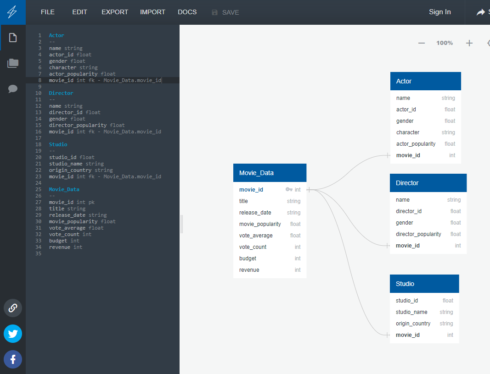
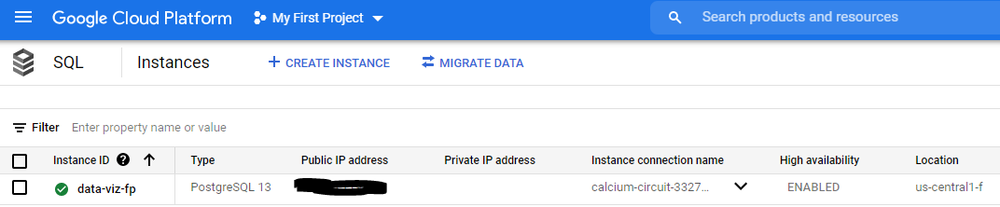

# Data Base Structure for Final Project 

## Overview
For our project we will be using the Google Cloud Platform to warehouse our data and PostgresSQL to interact with it.

## ERD:
In this process we created an ERD based from the tables we would like to use. 

## GCP:
We then created an instance in GCP that is connected to PostgreSQL.

## PostgreSQL:
Once the server was connected to PostgreSQL, a new database was created. A schema was then added and csv files from the API jupyter notebooks were loaded to them. The schema.sql file can be found in the Queries folder. Other team members now have access to the database through GCP.

