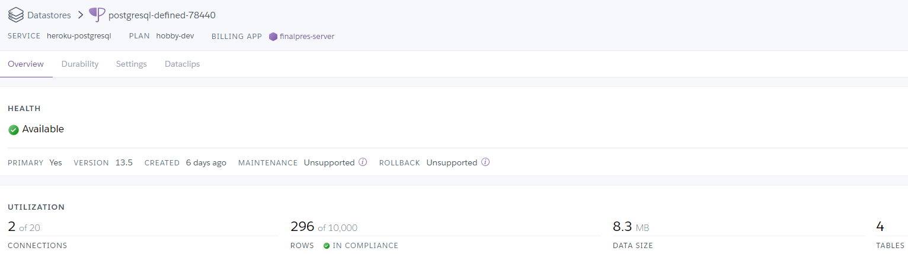
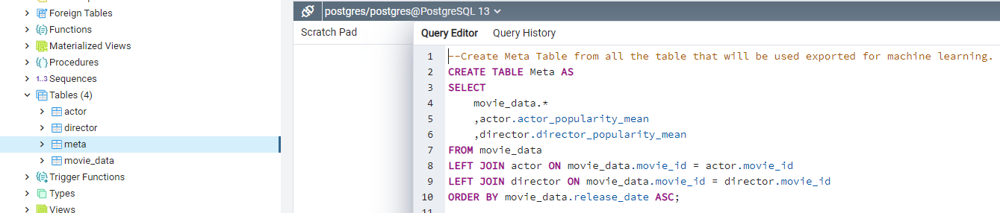
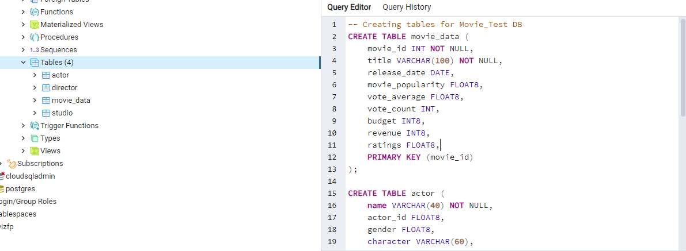
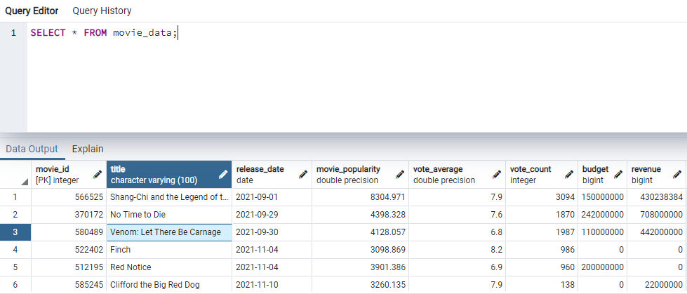

# Data Base Structure for Final Project 

## Deliverable 2:

## Overview:

At this stage we made a few changes to match the scope of the project. We switched form GCP to Heroku based on the size of the data and to eliminate any potential cost of resources. We also made changes to the ERD based on further data cleaning. The actor, director, and studio popularity scores were averaged for each movie before being added to the database. In the previous iteration each actor, director, or studio was listed for each movie. This caused many duplicates to be created when joining tables in postgresql. By taking the averages we are able to get better comparisons in our ML models and have more rows to store data in Heroku. The Heroku database is called in the ML models using SQLAlchemy, although some the notebooks are using CSVs to for testing purposes. However, the database is ready to be called at any time by any team member.

### ERD:
Updated ERD with mean data:

### Heroku:
Heroku DB for storage:

### PostgreSQL:
Merge of current tables with mean data:

### SQLalchemy conection in ML models:
Connecting ML Models to the Database:

## Deliverable 1:

### Overview:
For our project we will be using the Google Cloud Platform to warehouse our data and PostgresSQL to interact with it.

### ERD:
In this process we created an ERD based from the tables we would like to use. 

### GCP:
We then created an instance in GCP that is connected to PostgreSQL.

### PostgreSQL:
Once the server was connected to PostgreSQL, a new database was created. A schema was then added and csv files from the API jupyter notebooks were loaded to them. The schema.sql file can be found in the Queries folder. Other team members now have access to the database through GCP.

