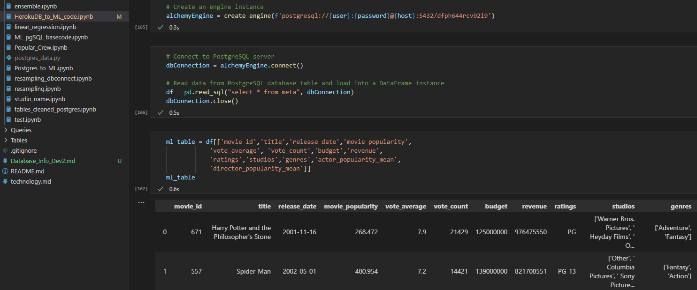

# F-PALS: [The Final Project](https://docs.google.com/presentation/d/1K_GDT5Z9gXgQocvto1T3PfcPokiHEzsp4WKGlrQmI7w/edit?usp=sharing)
For our final project we will be using machine learning on past, present, and future movies to predict and interpret revenue to dictate wether it was a success or not!

Our presentation on __*Google Slides*__ can be found with either the above link or __[HERE](https://docs.google.com/presentation/d/1K_GDT5Z9gXgQocvto1T3PfcPokiHEzsp4WKGlrQmI7w/edit?usp=sharing).__

The Tableau dashboard can be found with the link __[HERE](https://public.tableau.com/app/profile/freddie.cunha/viz/BoxOfficeAnalysis_16389287286030/BoxOfficeAnalysis?publish=yes).__

## __Profitibility of Movies Through Machine Learning__
### Why did we pick movies? And what are we hoping to answer?
__*Movies*__ are a cornerstone of culture worldwide as well as being one of the most lucrative businesses in media. They are a subject in which all of us within the group could relate with the sheer volume and appeal of which, there's a movie for everyone! There was an abundant amount of data available	for us to collect, especially with box office successes. For our final project we wanted to create a machine learning algorithm to predict how successful a movie would become on release as well as potential losses in profits due to a flop. 
Along with the flops and successes, we hope to discover the trends in movie production to find out how future movies will perform based on those variables tested and trained for.

### Where did we find our data? Why did we use it?
The source data that we have decided to use is from [The Movie Database](https://www.themoviedb.org/). It is a site very similar to [IMDB](https://www.imdb.com/) (a leading information resource on multimedia), focusing on movies and shows as well as having access to a free API through the [developers website for The Movie Database](https://developers.themoviedb.org/3/getting-started/introduction). This website also uses IMDB IDs for their films and other items of inquiry for ease of reference between both websites.

With our sample data that we pulled for our database and machine learning skeleton, we pulled the first 11 pages of the "popular movies" tag to test out our code and work out any kinks. The final API pull will be for all available movies to have as much data as possible before clearing out null values. 

The variables our team chose were what we thought would be most impactful to influence	the average moviegoer to watch it. This included the actors, directors, popularities, budgets, production studios, age ratings (in the US), and countries of origin. The final variable we needed was revenue/box office numbers to train and compare our machine learning findings to actual results as well as for seeing how well our model works on upcoming films. 

### Data Exploration: What did we initially uncover?
We had a few hypotheses on what can influence a movie in its performance for profitability. Initial thoughts were related to *names*, whether those belonged to actual people, groups/companies, or properties, clout with a name can influence if people are willing to watch.

We created variables of actor and director popularity averages because big names bring in big crowds of those familiar with their previous works. For example Steven Spielberg, Christopher Nolan, Egdar Wright are all recognizable auteurs in directing who have enough influence and star power that they can make their own original films without dipping into franchises for success.

The same goes for actors, but this is one that weighs more to the average audience member due to them being the faces of the movies they watch. They too can also go for more unique premises for movies and still bring in dedicated audiences. The advantage on weight also goes to actors because movies can have multiple heavy star powered actors in lead or supporting roles, a la the Marvel movies where almost every major charactor either was already or is now an A list actor. The more names a movie can bring in, the higher the probability for profitability.

Last of the big named variables is the studio. Studios are also now synonymous with the movies that they produce, such as Disney, Marvel, Pixar. Having a large and consistently chart topping studio as the creative team brings about a seal of quality for many average movie goers. 
The connecting tissue for all the above is __familiarity__. The average movie goer isn't a cinephile with terabytes of information at the ready in their head for movie trivia, but they are susceptible to recognizable names from actors to studios that have made something they watched before.

With the last largely affecting variable being the budget of the film. The more a movie spends, typically the bigger the hit. However, it also works that there are many popular movies in the past that were small budget, *OR* that there were huge flops because general audiences didn't like the film despite the large budget.

### Analysis: What could we conclude?
After some analysis on the pulled data many of our original hypotheses turned out to be true. 

On the website where we pulled our data, [The Movie Database](https://www.themoviedb.org/), they also had a *'popularity'* feature for actors, movies, and directors that took into account how often someone or something was looked at in order to create a 'popularity' figure to gauge the general audience interest in these specific persons of interest. It was a good measure on who or what was still relevant in the cultural zeitgeist, for example someone like James Dean, who has been gone for over 50 years, would have less popular relevance than Scarlett Johansson.

Our hypotheses on the other influential variables such as with studios and actors did return that those are large contributing factors to a movie's success, as noted by many of the top selling films of all time having Marvel or Disney as a noted studio. 

Another noted point of interest was movie franchises, some of the still popular movies to this day are connected to other movies by either being a part of the sequels or being in the franchise. There is no category for this within the API pull, however some examples of profitable franchises are Star Wars and Harry Potter, with each film more than making a profit even included the rule of thumb marketing costs.

## Technologies
### Data Cleaning and Analysis
The Pandas library and Jupter Notebooks will be used for the initial EDA and to clean the data. The link to The Movie DataBase and it's API can be found in the project README, but all data was obtained through this publicly accessible database. The majority of our work is done using Python.

### Database Storage
To store our data we created a database in pgAdmin with our exported csv file that were cleaned in Pandas. We will use postgreSQL to merge tables with our desired columns to run through our machine learning algorithm. We also use Heroku to host our data in a cloud based platform. 

### Machine Learning
We will use the SciKitLearn library for our machine learning model, for encoding, and for splitting our testing and training data sets. We will use a supervised machine learning algorithim to predict box office performance of upcoming movies. We will use 70% of our data to train the model, and 30% as our test data to validate our models performance. All categorical variables will have been encoded either by using an encoding dictionary or through One Hot Encoding, and quantitative data scaled before running the model. 

### Dashboard
We will create a Tableau Dashboard to display our data and it's results. Tableau allows us to create visually compelling graphs, charts, and maps of our data. 

## Database
At this stage we made a few changes to match the scope of the project. We switched form GCP to Heroku based on the size of the data and to eliminate any potential cost of resources. We also made changes to the ERD based on further data cleaning. The actor, director, and studio popularity scores were averaged for each movie before being added to the database. In the previous iteration each actor, director, or studio was listed for each movie. This caused many duplicates to be created when joining tables in postgresql. By taking the averages we are able to get better comparisons in our ML models and have more rows to store data in Heroku. The Heroku database is called in the ML models using SQLAlchemy, although some the notebooks are using CSVs to for testing purposes. However, the database is ready to be called at any time by any team member.

#### ERD:
Updated ERD with mean data:

#### Heroku:
Heroku DB for storage:

#### PostgreSQL:
Merge of current tables with mean data:

#### SQLalchemy conection in ML models:
Connecting ML Models to the Database:

#### Overview:
For our project we will be using the Google Cloud Platform to warehouse our data and PostgresSQL to interact with it.

#### ERD:
In this process we created an ERD based from the tables we would like to use. 

#### GCP:
We then created an instance in GCP that is connected to PostgreSQL.

#### PostgreSQL:
Once the server was connected to PostgreSQL, a new database was created. A schema was then added and csv files from the API jupyter notebooks were loaded to them. The schema.sql file can be found in the Queries folder. Other team members now have access to the database through GCP.

### Machine Learning Specifics
##### Preprocessing
1. To preprocess the data, first we grouped the actors each by their respective movies using movie_id, then averaged the popularity score of those actors in each movie to get one composite popularity score. We then repeated this process for the directors.
2. Then we looked at the studios column. After seeing how many studios only had one or two movies, we decided to bin all of those studios with less than 3 movies in our list to a bin we named “Other.” This left us with the top 10 studios and the “Other” bin.
3. The studios were then categorized using movie_id to create lists of of each individual studio that produced it 
4. The datetime variables were converted to the %Y-%m-%d format and then we used that to to encode using month number as a variable. Ie. January = 1, December = 12
5. The genres were broken down like the movie studios, so that each row contains a list of genres that were associated with each movie also using movie_id.
6. After creating the lists of studios and genres we then encoded them using OneHotEncoder.
7. We also encoded the ratings using a similar method to months. 
ratings_enc = {
    'G': 1,
    'PG': 2,
    'PG-13': 3,
    'R': 4,
    'NC-17': 5,
    'NR': 6
}
8. After encoding we noticed that budget, revenue, votes, and popularity scores had a wide range of numbers so we standardized those.
9. We then split the data using the default setting from sklearn's testtrainsplit module which is 75/25

For the model choice we decided to do a Logistic regression using a boolean to determine whether a movie was a success or not. The model does provide us a prediction of whether a movie will be successful however it does not give the estimated revenue that it is predicting only a yes or no. A benefit is that our model can be used as a quick identifier of whether a movie is a success or not. 

Balanced Random Forest Classifier and Easy Ensemble AdaBoost Classifier were used due to supervised imbalanced machine learning. The topic inherently has imbalances in what and what doesn't make a film profitable. Also, since we had used a boolean in profitability to determine a film's success, these classifiers were prime for usage for prediction.

For the scaling and training we just used x_train, y_train, x_scaled, y_scaled for our machine learning. At first our model was using a sample data set that we had gotten throught the API that, after thorough data cleaning, resulted in only 70 usable rows of data for the machine learning to train from and predict. After we had established a good system of cleaning the data after the API and sending it to the database and converting it into a CSV, we had gotten close to 2000 usable movies. The movies were taken from the first 200 pages of popular films. Part of the limitation was due to Heroku having a smaller row count due to being free.

Our accuracy scores ranged from 50% to 85% in the machine learning. It was purely predicting if the outcome of variables would result in a film making 2 times its original budget. The inaccuracy in itself after all the cleaning can be explained as movies just being difficult to predict if it will be a success or not. The limited data set, though still varied and inclusionary, compared to other topics can also be part of the machine learning having a difficult time even after training. However, even in the business world of filmmaking there are many outliers due to changing public interest, luck, or other unforseen variables. 

The world of film and its variables are vast, and as such there were limitations on how much each on mattered when it came to selling tickets. Various world politics and public opinions on actors, directors, studios also impact its profits. For example an actor in a scandal can be scored higher in ‘popularity’ because we don’t know the purpose of the clicks to their profile. The ‘rule of thumb’ for true profit to be achieved after reaching 2 times the original budget is an old rule and marketing expenditures are not public knowledge.

## Segment Roles:
For our project, we worked together almost daily. This resulted in much overlap from the specific named roles noted in the module and rubric in order to help each other out, especially after a teammate had been AWOL for most of our project.

__*Andrew*__:
1. Square: Mainly responsible for GitHub/Assisted in Machine Learning Preprocessing and Model Choice
2. Square: Mainly responsible for Machine Learning/Kept up GitHub and README
3. Square: Updated README/.gitignore was added in Segment 1/Continued to work on ML/Assisted Google Slides
4. Square: Finalizing README/Google Slides

__*Freddie*__: 
1. Triangle: Responsible for Machine Learning and data cleaning. Assisted in creating database
2. Circle: Preprocessed data for ML. Assisted with managing Git Hub
3. Triangle: Increased API pull and added data to database. Cleaned new data and preprocessed it for ML
4. : Created graphs for visualization, created dashboards, Assisted in creating Tabluea story and Google Slides. Helped edit ReadMe.

__*Sean*__: 
1. Circle: Mainly responsible for creating the ERD and creating a test database, as well as outline database interaction with machine learning.
2. Triangle: Built the database for the project using Heroku as a host and PostgreSQL to process the data.
3. X: Tested data by taking it from ETL models, adding it to the database, and compiling it into files for the machine learning models.
4. : Assisted by creating a few visualizations for the Tableau Dash Board.

__*Peter*__: 
1. X: Helped determine technologies to use along with other team members. Created technology.md file and pushed to github repo. 
2. X: Began developing dashboard on Tableau with test data set, began GoogleSlides presentation and layout.
3. Circle: Helped create storyboard and dashboard with full data set. Worked on visualizations and GoogleSlides presentation.
4. : Finalized Tableau Story and visualizations

__*Lanisha*__:

## Segment Notes
### Segment 1
* Pre-viz variables: actor/popularity_score, actor_id, director, director_id, studio, studio_id, producer, producer_id, budget, genre_id, genre, release date (encoded), release month (encoded), popularity, vote_avg, language, title, title_id, imdb_id, revenue
* Official variables: 
  * famous_actors: character, actor_gender, actor_id, actor_name (name), actor_popularity, movie_id
  * famous_directors: director_gender, director_id, director_name (name), director_popularity, movie_id
  * famous_studios: studio_id, movie_id, studio_name, origin_country
  * movies: movie_id, movie_title, budget, revenue, release_date, vote_average, movie_popularity, original_language, genre, genre_id, age_rating
* 11/19 due date: finishing up the CSVs (clean and update), technology.md, scheme, and sample database
* Quick notes on data cleaning: 
  * remove adult films
  * remove films with 0 in either budget or revenue
  * remove films with low vote_count to avoid small pop. bias
  * drop null values
  * boolean value for ML will be "hit"/"flop" (boolean pending) which will represent whether a movie made back its theorhetical budget or not
  * for movies, a typical rule of thumb on if it made its money back is 2x the original budget. the extra half is used for marketing.
  * if revenue > (2 * budget) then it made a profit
* Machine learning skeletons are placed in Tables folder

### Segment 2
* Finalize the database
  * Went with Heroku to avoid charges
  * Finalized all the joins and columns to be ready for ML integration
* Continue working on fine tuning the ML algorithms 
* Create a Google slide for presentation

### Segment 3
* Organize and sort the studios and genres alphabetically
  * This way the ML reads the combination of the genres and studios as a value when encoding, also to eliminate any repeats of the same studios/genres, but in a different order which would count as another category in the encoding
  * Also removed spaces, since it would eliminate more unnecessary data
